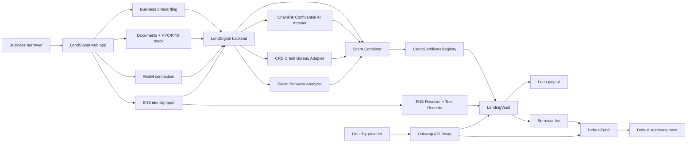
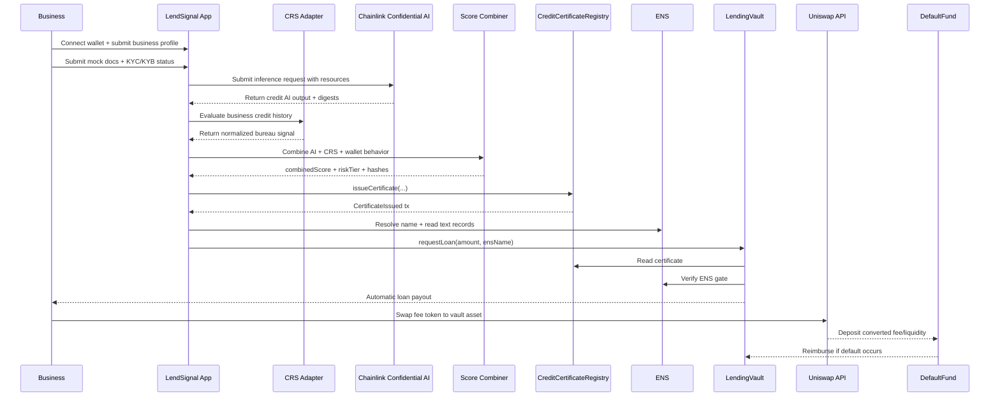
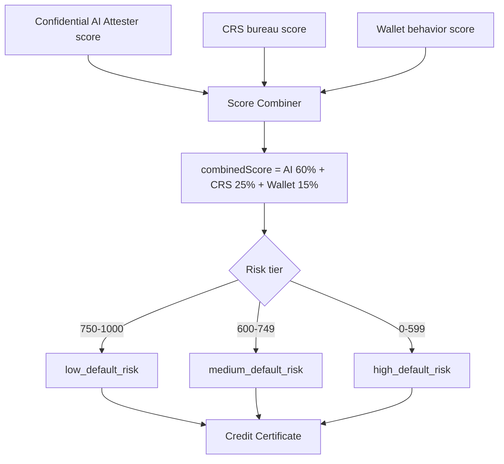
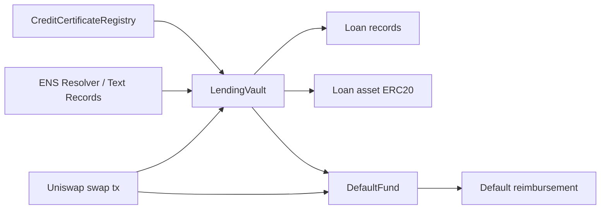
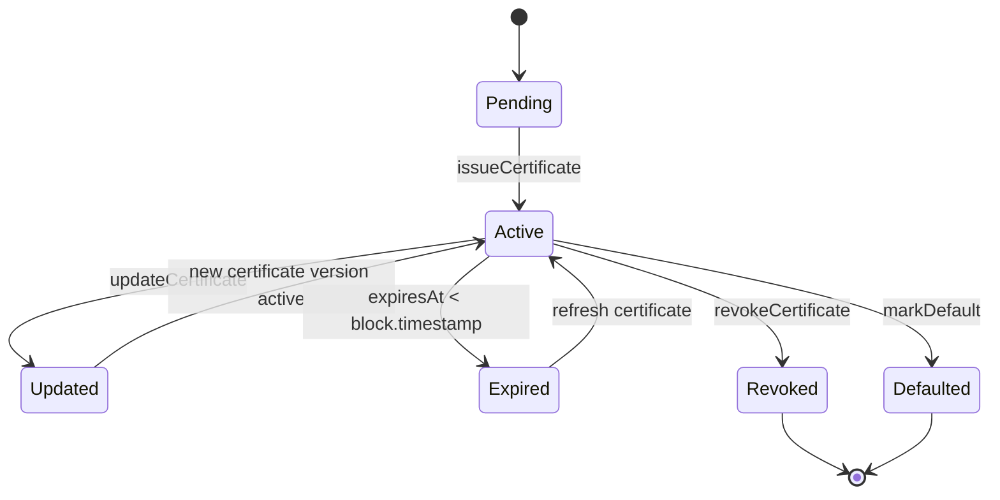
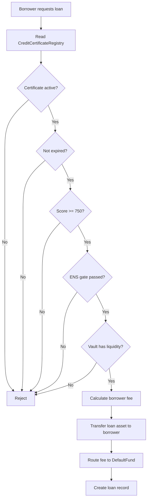
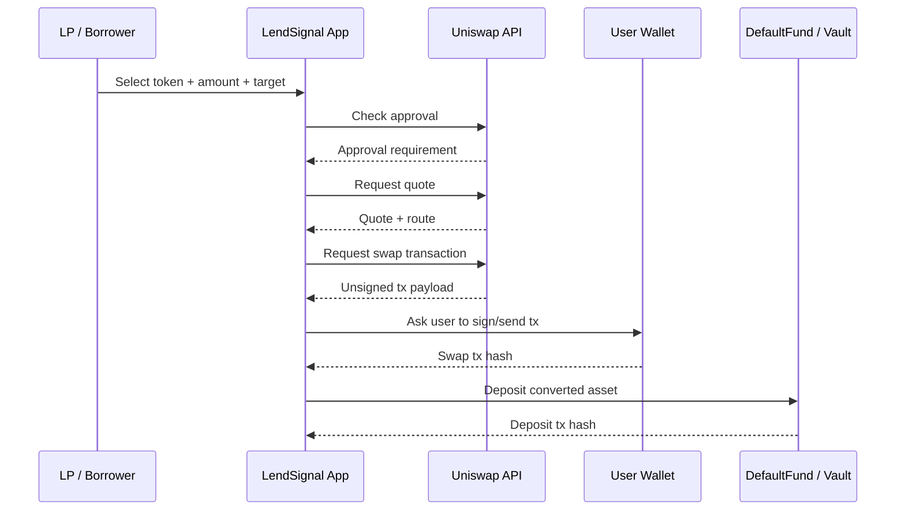
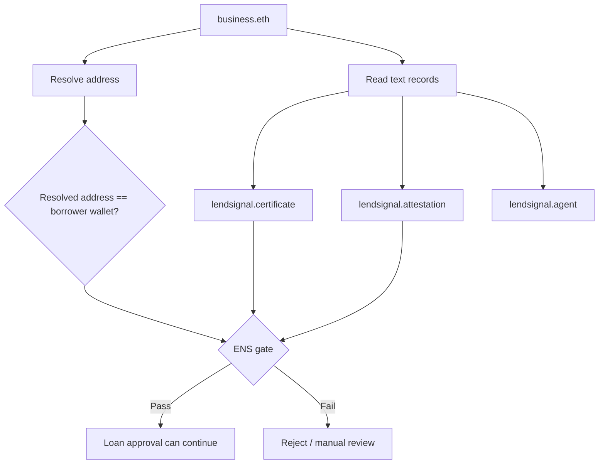
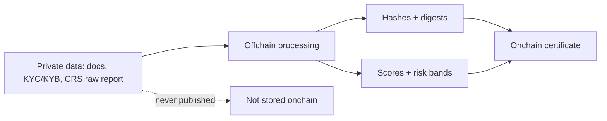
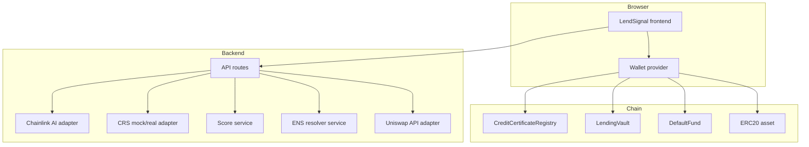

# LendSignal Architecture

## Architecture Goal

LendSignal turns a business wallet into an updateable onchain Credit Certificate.

The certificate is generated from:

- business onboarding data;
- mock KYC/KYB and documents;
- Chainlink Confidential AI Attester output;
- CRS credit bureau signal;
- wallet behavior;
- ENS identity records.

The certificate is then consumed by a lending vault, while Uniswap is used to execute liquidity and fee conversion into the vault/default-fund asset.

## System Diagram



## Component Responsibilities

| Component | Responsibility | Hackathon Implementation |
|---|---|---|
| Web app | User-facing onboarding, score, certificate, vault and default fund flows | Next.js or equivalent frontend |
| LendSignal backend | Orchestrates offchain APIs, mocks, score calculation and contract writes | API routes/server actions |
| Chainlink Confidential AI adapter | Processes sensitive borrower evidence and returns structured credit output | Real API if key exists, mock fallback otherwise |
| CRS Credit Bureau Adapter | Pulls business/principal credit-history data and normalizes it | Mock CRS response now, real CRS later |
| Wallet Behavior Analyzer | Scores wallet age, stablecoin activity, repayment activity and risk flags | Deterministic mock or simple onchain scan |
| Score Combiner | Produces final `combinedScore` and risk tier | 60% AI, 25% CRS, 15% wallet behavior |
| CreditCertificateRegistry | Stores updateable onchain certificate | Solidity contract |
| ENS Resolver/Gate | Resolves business name and validates text records | ENS read integration |
| LendingVault | Approves and pays out loans based on certificate policy | Solidity contract |
| Uniswap API integration | Converts LP/borrower tokens into vault/default-fund asset | Quote + swap + tx hash |
| DefaultFund | Holds protection liquidity and reimburses defaults | Solidity contract |

## End-To-End Data Flow



## Scoring Architecture



## Offchain Services

### Chainlink Confidential AI Adapter

Inputs:

- business profile;
- document resources;
- KYC/KYB mock status;
- requested loan purpose;
- prompt.

Outputs:

- `business_verified`;
- `document_authenticity`;
- `fraud_risk`;
- `cashflow_strength`;
- `debt_capacity`;
- `creditworthiness_score`;
- `risk_tier`;
- `reasoning_summary`;
- resource digests.

### CRS Credit Bureau Adapter

Inputs:

- legal business name;
- address/country/state;
- industry;
- business wallet;
- owner/principal metadata if available.

Outputs:

- `businessVerified`;
- `principalMatched`;
- `bureauScore`;
- `paymentRisk`;
- `fraudRisk`;
- `publicRecordsRisk`;
- `recommendedCreditLimitUsd`;
- `delinquencyRisk12mo`;
- positive/adverse signal summary;
- `rawReportHash`.

### Wallet Behavior Analyzer

Inputs:

- wallet address;
- token activity;
- stablecoin flow;
- lending/borrowing interactions;
- liquidation/default history if available.

Outputs:

- `walletBehaviorScore`;
- risk flags;
- summary.

## Onchain Architecture



Onchain contracts:

- `CreditCertificateRegistry`;
- `LendingVault`;
- `DefaultFund`;
- optional mock ERC20 asset for local/testnet demo.

External onchain dependencies:

- ENS resolver reads;
- Uniswap swap transaction;
- ERC20 loan/default-fund asset.

## Certificate Lifecycle



## Lending Decision Flow



## Uniswap Integration Architecture



Use cases:

- LP deposits WETH or another token, then Uniswap converts to USDC/default-fund asset.
- Borrower pays fee in any supported token, then Uniswap converts fee to default-fund asset.

## ENS Architecture



Required text records:

```text
lendsignal.certificate = <certificateId or registry pointer>
lendsignal.attestation = <attestationHash>
lendsignal.risk-tier = <risk tier>
lendsignal.agent = <agent ENS name>
```

## Privacy Boundary



Do not put onchain:

- raw documents;
- full CRS reports;
- full KYC/KYB records;
- bank statements;
- tax records;
- private invoices;
- personal identity documents.

Publish onchain:

- business wallet;
- score;
- risk tier;
- certificate status;
- attestation hash;
- evidence digest;
- expiration.

## Deployment View


