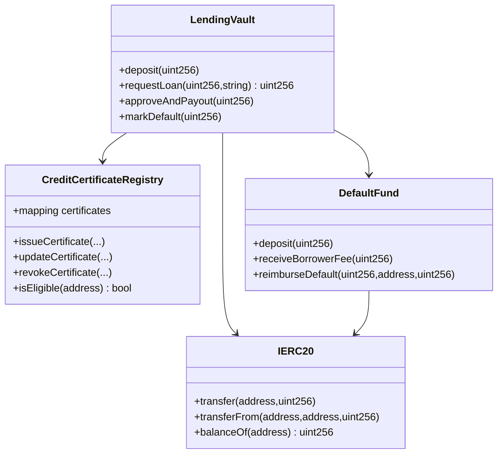
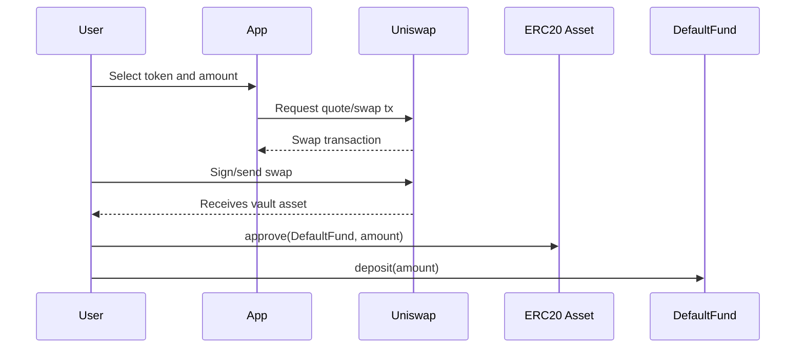
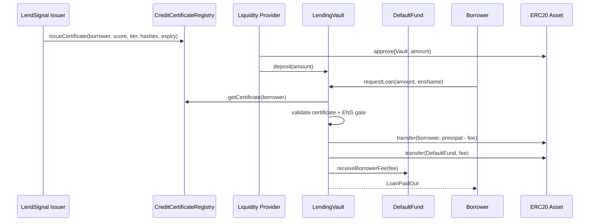

# Smart Contract Architecture

## Contract Overview

LendSignal needs three core contracts for the hackathon MVP:



Optional for test/demo:

- `MockUSDC`;
- `MockENSVerifier` if real ENS gate is not ready in contract logic;
- `DemoController` for admin-triggered demo actions.

## Contract Responsibilities

| Contract | Purpose | Must Have For MVP |
|---|---|---|
| `CreditCertificateRegistry` | Stores updateable credit certificates by business wallet | Yes |
| `LendingVault` | Holds loan liquidity and pays out approved loans | Yes |
| `DefaultFund` | Holds protection liquidity and reimburses defaults | Yes |
| `MockUSDC` | Demo ERC20 asset for lending and fund accounting | Optional but useful |
| `MockENSVerifier` | Encodes ENS gate result if contract-level ENS resolution is too heavy | Optional |

## CreditCertificateRegistry

### Purpose

The registry is the onchain source of truth for whether a business wallet has an active, unexpired and eligible Credit Certificate.

### State

```solidity
enum RiskTier {
    High,
    Medium,
    Low
}

struct CreditCertificate {
    uint256 score;
    RiskTier riskTier;
    bytes32 attestationHash;
    bytes32 evidenceDigest;
    uint256 issuedAt;
    uint256 expiresAt;
    bool active;
}

mapping(address => CreditCertificate) public certificates;
address public issuer;
uint256 public minEligibleScore;
```

### Functions

```solidity
function issueCertificate(
    address borrower,
    uint256 score,
    RiskTier riskTier,
    bytes32 attestationHash,
    bytes32 evidenceDigest,
    uint256 expiresAt
) external onlyIssuer;

function updateCertificate(
    address borrower,
    uint256 score,
    RiskTier riskTier,
    bytes32 attestationHash,
    bytes32 evidenceDigest,
    uint256 expiresAt
) external onlyIssuer;

function revokeCertificate(address borrower) external onlyIssuer;

function getCertificate(address borrower)
    external
    view
    returns (CreditCertificate memory);

function isEligible(address borrower) external view returns (bool);
```

### Events

```solidity
event CertificateIssued(
    address indexed borrower,
    uint256 score,
    RiskTier riskTier,
    bytes32 attestationHash,
    bytes32 evidenceDigest,
    uint256 expiresAt
);

event CertificateUpdated(
    address indexed borrower,
    uint256 score,
    RiskTier riskTier,
    bytes32 attestationHash,
    bytes32 evidenceDigest,
    uint256 expiresAt
);

event CertificateRevoked(address indexed borrower);
```

### Eligibility Logic

```text
eligible if:
  active = true
  block.timestamp < expiresAt
  score >= minEligibleScore
  riskTier == Low or Medium
```

## LendingVault

### Purpose

The lending vault holds loan liquidity and pays out loans automatically when the borrower passes certificate and ENS checks.

### State

```solidity
struct Loan {
    uint256 id;
    address borrower;
    uint256 principal;
    uint256 fee;
    uint256 issuedAt;
    uint256 dueAt;
    bool paidOut;
    bool defaulted;
    bool reimbursed;
    string ensName;
}

IERC20 public asset;
CreditCertificateRegistry public certificateRegistry;
DefaultFund public defaultFund;
address public ensVerifier;

uint256 public nextLoanId;
uint256 public minScore;
uint256 public originationFeeBps;
mapping(uint256 => Loan) public loans;
```

### Functions

```solidity
function deposit(uint256 amount) external;

function requestLoan(
    uint256 amount,
    string calldata ensName
) external returns (uint256 loanId);

function approveAndPayout(uint256 loanId) external;

function markDefault(uint256 loanId) external;
```

### Approval Logic

```text
approveAndPayout:
  1. Load loan.
  2. Load borrower certificate.
  3. Require certificate active.
  4. Require certificate unexpired.
  5. Require score >= minScore.
  6. Require ENS gate passed.
  7. Require vault has enough asset balance.
  8. Calculate fee.
  9. Transfer principal - fee to borrower.
  10. Transfer fee to DefaultFund.
  11. Mark loan as paid out.
```

### Events

```solidity
event VaultDeposit(address indexed lender, uint256 amount);
event LoanRequested(uint256 indexed loanId, address indexed borrower, uint256 amount, string ensName);
event LoanPaidOut(uint256 indexed loanId, address indexed borrower, uint256 principal, uint256 fee);
event LoanDefaulted(uint256 indexed loanId, address indexed borrower, uint256 principal);
```

## DefaultFund

### Purpose

The default fund gives lenders protection when undercollateralized borrowers default.

### State

```solidity
IERC20 public asset;
address public lendingVault;

mapping(address => uint256) public lpBalances;
uint256 public totalDeposits;
uint256 public totalBorrowerFees;
uint256 public totalReimbursed;
```

### Functions

```solidity
function deposit(uint256 amount) external;

function receiveBorrowerFee(uint256 amount) external;

function reimburseDefault(
    uint256 loanId,
    address recipient,
    uint256 amount
) external onlyVault;
```

### Events

```solidity
event DefaultFundDeposit(address indexed lp, uint256 amount);
event BorrowerFeeReceived(uint256 amount);
event DefaultReimbursed(uint256 indexed loanId, address indexed recipient, uint256 amount);
```

## ENS Gate Design

### Best Hackathon Version

Keep ENS verification in the app/backend for speed:

```text
1. Resolve borrower ENS name.
2. Confirm resolved address == borrower wallet.
3. Read text records.
4. Confirm lendsignal.attestation == certificate.attestationHash.
5. Pass boolean into loan request UI.
```

Then the contract stores the `ensName` in the loan record.

### Stronger Contract Version

Add an `IENSVerifier` interface:

```solidity
interface IENSVerifier {
    function isVerified(
        address borrower,
        string calldata ensName,
        bytes32 attestationHash
    ) external view returns (bool);
}
```

`LendingVault` calls:

```solidity
require(
    IENSVerifier(ensVerifier).isVerified(
        loan.borrower,
        loan.ensName,
        certificate.attestationHash
    ),
    "ENS_GATE_FAILED"
);
```

For MVP, `MockENSVerifier` can return true for configured borrower/name/hash combinations.

## Uniswap Integration Boundary

Uniswap swaps should happen before contract deposits:



This keeps contracts simple:

- Uniswap API handles routing and swap tx generation.
- Contracts only receive the final ERC20 asset.
- Demo still shows real Uniswap API usage and tx hash.

## Contract Interaction Flow



## Suggested Solidity Files

```text
contracts/
  CreditCertificateRegistry.sol
  LendingVault.sol
  DefaultFund.sol
  interfaces/
    ICreditCertificateRegistry.sol
    IDefaultFund.sol
    IENSVerifier.sol
  mocks/
    MockUSDC.sol
    MockENSVerifier.sol
```

## Security Notes For Hackathon

Keep the MVP safe enough for demo:

- Use `onlyIssuer` for certificate writes.
- Use `onlyVault` for default reimbursement.
- Check certificate expiration.
- Check score threshold.
- Prevent double payout with `loan.paidOut`.
- Prevent double reimbursement with `loan.reimbursed`.
- Emit events for every demo-critical action.
- Do not store raw borrower data onchain.

Things we do not solve in MVP:

- decentralized issuer set;
- real legal loan enforcement;
- real KYC/KYB provider;
- real default adjudication;
- production LP accounting;
- yield distribution math.

## Demo Transaction Checklist

Required tx IDs:

- `CertificateIssued`;
- `VaultDeposit`;
- `LoanRequested`;
- `LoanPaidOut`;
- Uniswap swap transaction;
- `DefaultFundDeposit` or `BorrowerFeeReceived`;
- `DefaultReimbursed` if demoing default.

## Minimal Deployment Order

```text
1. Deploy MockUSDC.
2. Deploy CreditCertificateRegistry.
3. Deploy DefaultFund with MockUSDC.
4. Deploy LendingVault with MockUSDC, registry and default fund.
5. Configure DefaultFund vault address.
6. Deploy MockENSVerifier if using contract-level ENS gate.
7. Fund LP account with MockUSDC.
8. Run certificate issue + loan payout demo.
```
